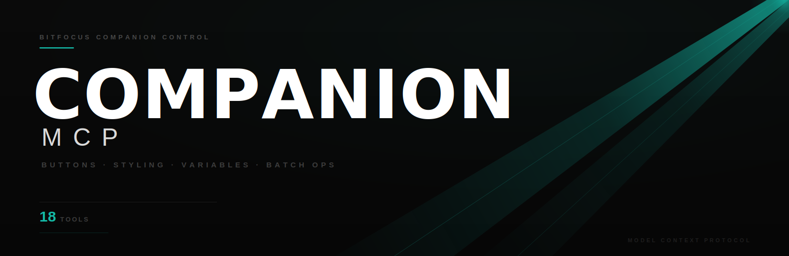
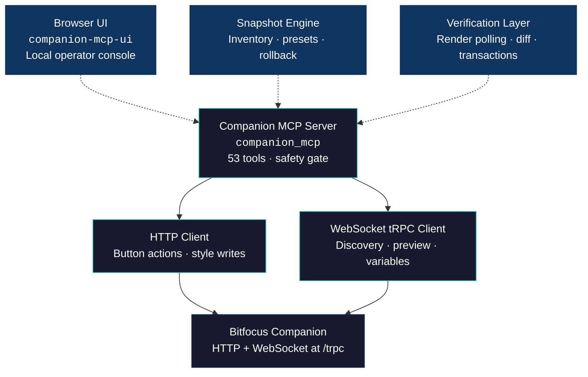

<p align="center">
  
</p>

# Companion MCP

<p align="center">
  <a href="https://github.com/drohi-r/companion-mcp/blob/main/LICENSE"></a>
  
  
  
</p>

An MCP server for [Bitfocus Companion](https://bitfocus.io/companion). Exposes 53 tools covering verified button control, styling, page discovery, runtime summaries, inventory diffing, checkpointed rollback/restore workflows, preset management, variable management, and batch show programming — so AI assistants can operate Stream Deck surfaces and other Companion-connected devices through Companion's current APIs.

Built for live production. Pairs with [grandMA2 MCP](https://github.com/drohi-r/grandma2-mcp), [Resolume MCP](https://github.com/drohi-r/resolume-mcp), [MADRIX MCP](https://github.com/drohi-r/madrix-mcp), and [Beyond MCP](https://github.com/drohi-r/beyond-mcp) for full AI-driven show control.

The repo also includes a lightweight local browser UI for humans who want the same verified flows without manually issuing MCP tool calls.

## Why this exists

Companion is the physical button layer that ties a live production stack together. An operator presses a Stream Deck button and it fires a grandMA2 cue, triggers a Resolume clip, or starts a laser sequence. But programming those buttons is manual — you click through the Companion UI, one button at a time, configuring actions, labels, and colors.

This MCP server lets an AI do that work. It can read your current button layout, preview changes before applying them, and batch-program entire pages in seconds. Combined with MA2 Agent and Resolume MCP, an AI assistant can program the entire show control surface from a single conversation.

## Quick start

```bash
git clone https://github.com/drohi-r/companion-mcp && cd companion-mcp
uv sync
uv run python -m companion_mcp
```

## Browser UI

Run the local operator UI:

```bash
uv run companion-mcp-ui
```

Then open:

```text
http://127.0.0.1:8088
```

The UI is intentionally local-first. It sits on top of the same backend logic as the MCP tools, so verified writes, snapshots, presets, and rollback behave the same in the browser as they do through MCP.

Make sure Companion is running on the target host and port. Current Companion builds use:
- HTTP endpoints for button actions and style writes
- websocket tRPC at `/trpc` for richer reads, discovery, preview, and variable inspection

## Configuration

| Variable | Default | Description |
|----------|---------|-------------|
| `COMPANION_HOST` | `127.0.0.1` | Companion instance IP |
| `COMPANION_PORT` | `8000` | Companion HTTP and websocket port |
| `COMPANION_TIMEOUT_S` | `10.0` | HTTP request timeout in seconds |
| `COMPANION_ALLOWED_HOSTS` | `127.0.0.1,localhost,::1` | Comma-separated allowlist for target hosts. Set `*` to allow any. |
| `COMPANION_WRITE_ENABLED` | `1` | Set to `0` for read-only mode |
| `COMPANION_TRANSPORT` | `stdio` | MCP transport (`stdio`, `sse`, `streamable-http`) |
| `COMPANION_UI_HOST` | `127.0.0.1` | Browser UI bind address |
| `COMPANION_UI_PORT` | `8088` | Browser UI port |

## Architecture



## Tools

### Discovery and reads

Safe, read-only tools for understanding the current state of Companion.

| Tool | What it does |
|------|-------------|
| `get_server_config` | Return current MCP server configuration and safety settings |
| `health_check` | Probe Companion API reachability and return status |
| `list_surfaces` | List connected control surfaces (Stream Deck, etc.) |
| `get_button_info` | Read the current control and preview state for a specific button |
| `get_button_runtime_summary` | Return a compact operator-oriented runtime summary for a button |
| `get_page_grid` | Read a rectangular grid of buttons from a page |
| `snapshot_page_inventory` | Export a page region with concise button summaries, style, feedback, and preview hashes |
| `save_page_inventory_snapshot` | Save a named page inventory checkpoint to disk |
| `load_page_inventory_snapshot` | Load a saved page inventory checkpoint from disk |
| `list_page_inventory_snapshots` | List saved page inventory checkpoint files |
| `delete_page_inventory_snapshot` | Delete a saved page inventory checkpoint file |
| `diff_page_inventory` | Compare two page inventory snapshots and summarize changed buttons |
| `preview_restore_page_style_from_inventory` | Turn a saved inventory snapshot into a restore plan without writing to Companion |
| `preview_restore_page_style_from_snapshot` | Preview a restore plan from a named saved snapshot |
| `save_page_style_preset` | Save current page style entries as a reusable preset |
| `load_page_style_preset` | Load a saved page style preset |
| `list_page_style_presets` | List saved page style presets |
| `delete_page_style_preset` | Delete a saved page style preset |
| `preview_apply_page_style_preset` | Preview applying a saved page style preset with optional offsets |
| `find_buttons` | Search a page region by visible text, control id, control type, connection id, or definition id |
| `export_page_layout` | Export a page region as a reusable layout payload |
| `get_custom_variable` | Read a Companion custom variable |
| `get_module_variable` | Read a variable from a Companion module connection |
| `snapshot_custom_variables` | Read a named list of custom variables in one call |
| `verify_button_render_change` | Compare a current button preview hash to a previous one |

### Preview (plan before you write)

Validate and preview operations without touching Companion. Use these to inspect what a batch operation will do before committing.

| Tool | What it does |
|------|-------------|
| `preview_page_style` | Validate and preview a page-style batch |
| `preview_label_button_grid` | Resolve a label grid into coordinates |
| `preview_button_template` | Place a reusable template at an origin and preview the result |

### Button actions

Require `COMPANION_WRITE_ENABLED=1` (default).

| Tool | What it does |
|------|-------------|
| `press_button` | Press and release a button |
| `press_button_verified` | Press a button and poll for visible/runtime state change |
| `hold_button` | Press and hold (down actions only) |
| `release_button` | Release a held button (up actions) |
| `rotate_left` | Rotate encoder left |
| `rotate_right` | Rotate encoder right |
| `set_step` | Set the current action step |

### Button styling

| Tool | What it does |
|------|-------------|
| `set_button_text` | Change button display text |
| `set_button_color` | Change text and/or background color (6-digit hex) |
| `set_button_style` | Set multiple style properties at once |
| `set_button_style_verified` | Apply style changes and poll until the render catches up or the timeout expires |

### Batch operations

| Tool | What it does |
|------|-------------|
| `press_button_sequence` | Press multiple buttons in order with configurable delay |
| `set_page_style` | Batch-set style on multiple buttons on a page |
| `set_page_style_verified` | Batch-set styles on a page and return per-button verification plus an inventory diff |
| `restore_page_style_from_inventory` | Restore button styles from a previously captured page inventory |
| `restore_selected_page_style_from_inventory` | Restore only selected coordinates from an inventory snapshot |
| `restore_page_style_from_snapshot` | Restore styles from a named saved snapshot |
| `apply_page_style_transaction` | Save a rollback checkpoint, apply verified styles, and return rollback metadata |
| `rollback_page_style_transaction` | Roll back a named transaction snapshot |
| `apply_page_style_preset` | Apply a saved page style preset with optional offsets |
| `label_button_grid` | Label a grid of buttons from a flat list of names |
| `apply_button_template` | Apply a reusable button template at a page origin |

### Variables and system

| Tool | What it does |
|------|-------------|
| `set_custom_variable` | Write a Companion custom variable |
| `rescan_surfaces` | Rescan connected USB surfaces |
| `press_bank_button` | Legacy bank API (deprecated, still works) |

## Claude Desktop

```json
{
  "mcpServers": {
    "companion": {
      "command": "uv",
      "args": ["run", "--directory", "/path/to/companion-mcp", "python", "-m", "companion_mcp"],
      "env": {
        "COMPANION_HOST": "127.0.0.1",
        "COMPANION_PORT": "8000"
      }
    }
  }
}
```

## VS Code / Cursor

```json
{
  "servers": {
    "companion": {
      "command": "uv",
      "args": ["run", "--directory", "/path/to/companion-mcp", "python", "-m", "companion_mcp"],
      "env": {
        "COMPANION_HOST": "127.0.0.1",
        "COMPANION_PORT": "8000"
      }
    }
  }
}
```

## Codex

Create a `codex.json` MCP config file:

```json
{
  "mcpServers": {
    "companion": {
      "command": "uv",
      "args": ["run", "--directory", "/path/to/companion-mcp", "python", "-m", "companion_mcp"],
      "env": {
        "COMPANION_HOST": "127.0.0.1",
        "COMPANION_PORT": "8000"
      }
    }
  }
}
```

Then run Codex with:

```bash
codex --mcp-config codex.json
```

## Production safety

This server is designed for live show environments where accidental writes can disrupt a running production.

- **Host allowlisting** — only `127.0.0.1`, `localhost`, and `::1` are permitted by default. Add LAN hosts explicitly via `COMPANION_ALLOWED_HOSTS`.
- **Write gating** — set `COMPANION_WRITE_ENABLED=0` to block all write operations. Read and preview tools remain available.
- **Preview before apply** — every batch operation has a corresponding preview tool that validates inputs and shows exactly what will change, without touching Companion.
- **Verified writes** — prefer `press_button_verified` and `set_button_style_verified` when you care about actual visible or runtime state changes, not just HTTP acceptance.
- **Snapshot and diff workflow** — use `snapshot_page_inventory` before and after batch changes, or let `set_page_style_verified` produce an inventory diff automatically.
- **Rollback path** — capture a page with `snapshot_page_inventory` or `save_page_inventory_snapshot`, inspect the restore plan with `preview_restore_page_style_from_inventory` or `preview_restore_page_style_from_snapshot`, then use the matching restore tool to roll styles back cleanly.
- **Transaction flow** — `apply_page_style_transaction` creates a named rollback checkpoint before it writes. `rollback_page_style_transaction` restores from that named snapshot.
- **Preset workflow** — save reusable page styles with `save_page_style_preset`, inspect with `preview_apply_page_style_preset`, and deploy with `apply_page_style_preset`.
- **Input validation** — page, row, column, color hex, delay bounds, and template structure are all validated before any API call is made. Invalid inputs return structured JSON errors, never raw exceptions.
- **Error isolation** — all tools are wrapped in `_handle_errors`. Network failures, JSON parse errors, and validation failures return `{"ok": false, "error": "...", "blocked": true}` instead of crashing the MCP session.

## Live behavior notes

- A successful HTTP write does not always mean the button visibly changed immediately.
- Current Companion builds can update stored style state first, then repaint the preview a short time later.
- `set_button_style_verified` and `press_button_verified` include bounded polling so the MCP can distinguish:
  - write accepted but nothing observable changed
  - write accepted and the preview changed after a short delay
  - write accepted and style state changed, but visible render still did not change

## Why the UI helps

The MCP backend is already the real product. The UI does not replace it; it makes it faster and safer for humans:

- click buttons in a page grid instead of remembering `page,row,column`
- inspect preview, style, runtime summary, and the last verified response in one place
- save and browse snapshots and presets without opening JSON files
- run verified style changes and transaction rollback from a browser during show prep
- hand the system to an operator who is not going to type MCP calls by hand

## Development

```bash
uv sync
uv run python -m pytest -v
```

## License

[Apache 2.0](LICENSE)
